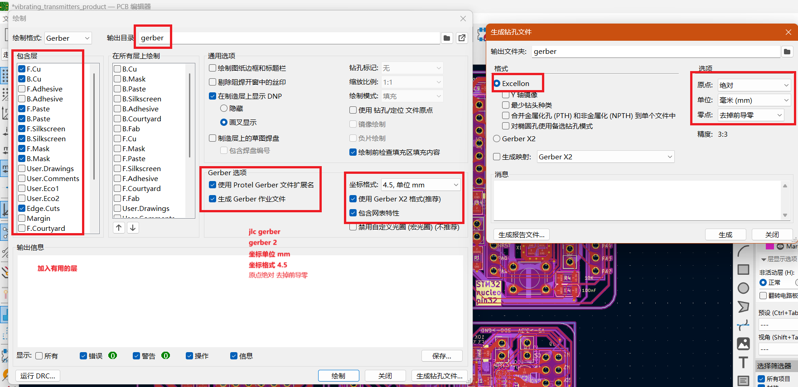

# python-code  
  
## kicad_ad2jlc_gerber  
这个项目,这是kicad 的gerber 生成 嘉立创的 gerber,按照嘉立创的 gerber的要求,生成gerber是最好如下    
  
然后将生成的gerber文件夹放在kicad_ad2jlc_gerber中, 执行命令  
```python
python 2jlc.py
```
如果是debian  
```python
python3 2jlc.py
```